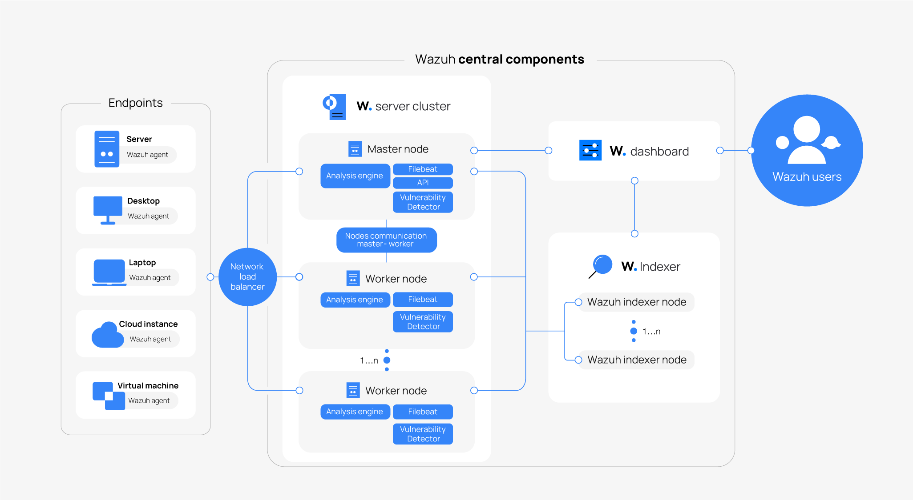
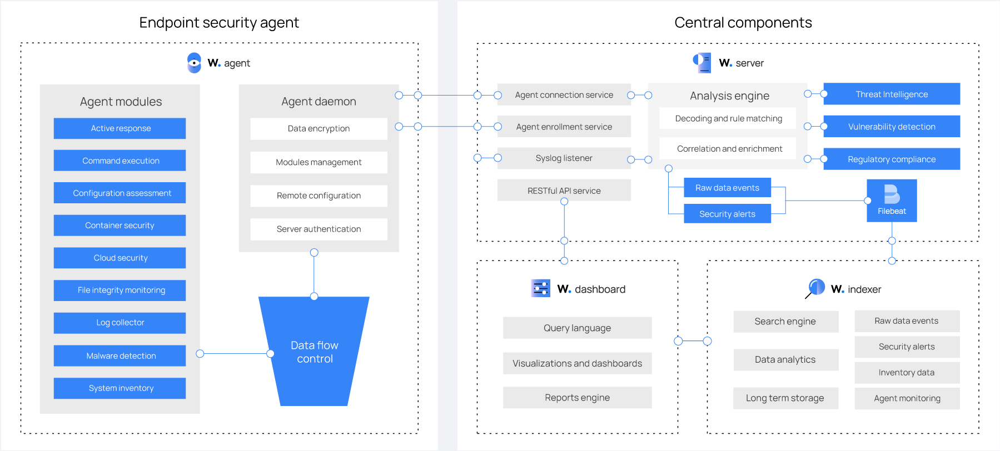

# Tutorial Completo: Implementación de Wazuh para Monitoreo de Contenedores Docker y Red

Este tutorial proporciona una guía detallada para implementar Wazuh como solución de monitoreo de seguridad, con enfoque especial en el monitoreo de contenedores Docker y redes.

## Contenido

1. [Introducción](introduccion.md)
2. [Infraestructura y Requisitos Previos](seccion1.md)
3. [Instalación del Stack de Servidor Wazuh](seccion2.md)
4. [Configuración de Acceso Remoto al Dashboard](seccion3.md)
5. [Implementación de Docker en el Servidor](seccion4.md)
6. [Creación y Configuración de Contenedores para Pruebas](seccion5.md)
7. [Instalación y Configuración del Agente Wazuh en Contenedores](seccion6.md)
8. [Implementación de Monitoreo Agentless](seccion7.md)
9. [Verificación y Pruebas](seccion8.md)
10. [Consideraciones de Seguridad y Mejores Prácticas](seccion9.md)
11. [Conclusión y Referencias](conclusion.md)

## Diagramas de Arquitectura

### Arquitectura General de Wazuh

### Flujo de Datos entre Componentes de Wazuh

## Requisitos

- Servidor Linux (Ubuntu 22.04 LTS recomendado)
- Mínimo 4GB de RAM (8GB recomendado)
- 50GB de espacio en disco
- Conexión a Internet
- Privilegios de administrador

## Acerca de Wazuh

Wazuh es una plataforma de seguridad de código abierto que proporciona capacidades de XDR (Extended Detection and Response) y SIEM (Security Information and Event Management). Ofrece protección para entornos en la nube, contenedores y servidores, incluyendo análisis de logs, detección de intrusiones y malware, monitoreo de integridad de archivos, evaluación de configuraciones, detección de vulnerabilidades y soporte para cumplimiento normativo.

## Licencia

Este tutorial se distribuye bajo la licencia [Creative Commons Attribution 4.0 International License](https://creativecommons.org/licenses/by/4.0/).

## Autor

Este tutorial ha sido creado por Manus AI.

## Fecha de Creación

Abril 2025
